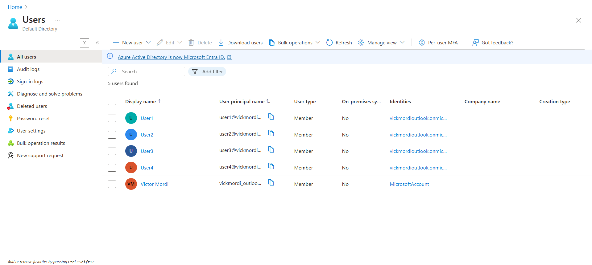
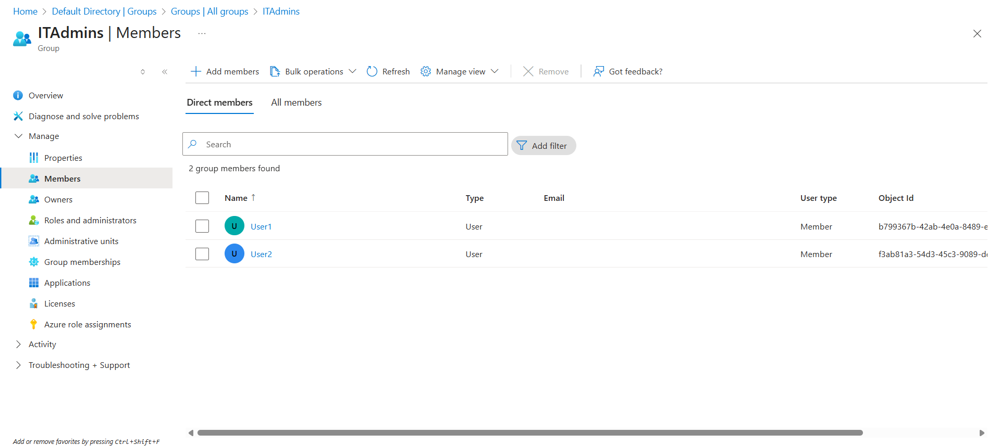
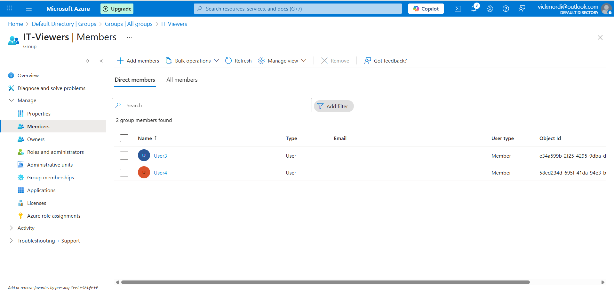
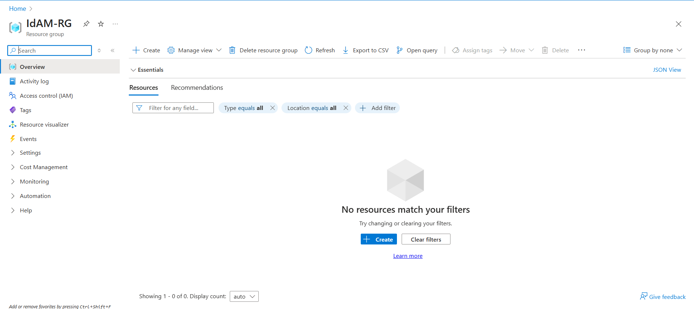
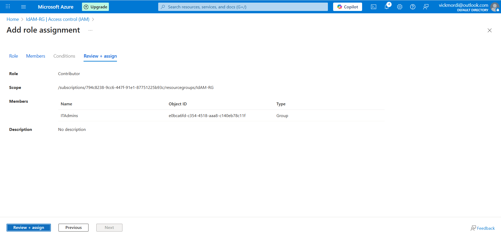
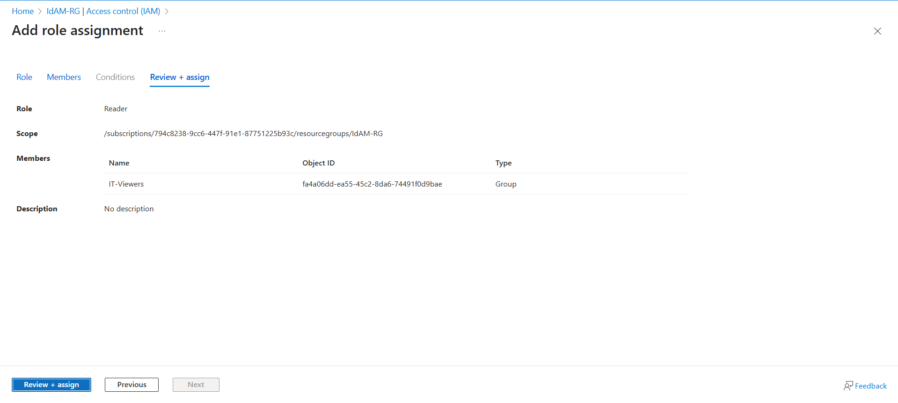
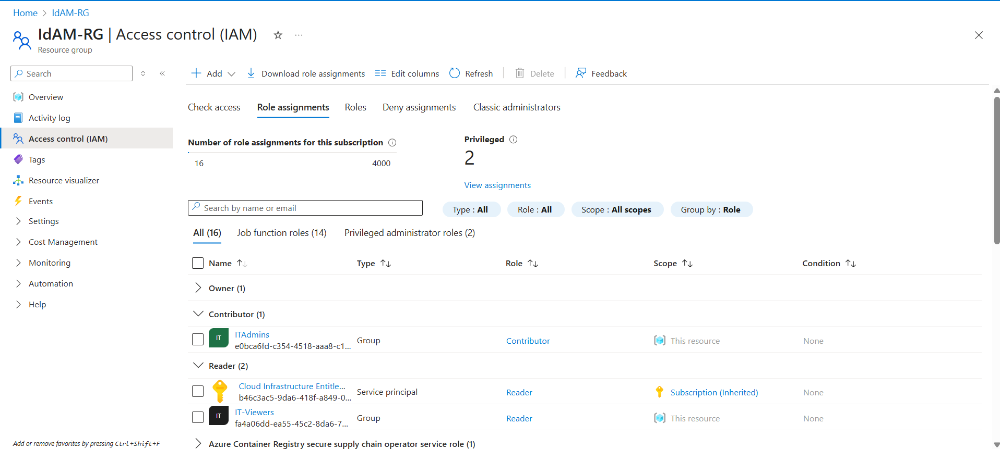

# 🔐 Azure Identity and Access Management (IAM) Role Simulation

This project demonstrates a practical simulation of Identity and Access Management (IAM) in the cloud using Microsoft Entra ID (formerly Azure Active Directory). IAM is a foundational pillar of cloud security, and this project showcases how organizations can implement secure user access and permissions in Microsoft Azure.

## ☁️ Project Overview

In modern cloud environments, managing **who has access to what** is critical to maintaining security, operational integrity, and compliance. This project simulates how businesses use IAM systems to provision users, assign them to appropriate groups, and enforce access rules through Role-Based Access Control (RBAC).

## 🧩 What Was Implemented

- Provisioned users within **Microsoft Entra ID (Azure AD)**
- Created user groups (e.g., IT-Admins, IT-Viewers) to represent different access roles
- Applied **RBAC roles** (Reader, Contributor) at the **Azure Resource Group** level
- Simulated login behavior for users to test role effectiveness
- Demonstrated **least privilege access** and how IAM prevents unauthorized resource usage

## 🔐 Why IAM is Critical in the Cloud

Identity and Access Management is at the heart of cloud governance. With cloud resources being accessed from multiple locations and by diverse roles (admins, developers, analysts), organizations must:
- **Enforce least privilege access**
- **Secure sensitive workloads**
- **Prevent data leaks and insider threats**
- **Ensure compliance with internal and external policies**
  
IAM solutions like Azure AD help administrators assign, control, and audit permissions while providing seamless sign-in experiences for users.

## 🧠 Skills Gained

- Microsoft Entra ID (Azure Active Directory)
- Identity and Access Management (IAM)
- Role-Based Access Control (RBAC)
- Azure Resource Group Permissions
- User & Group Configuration in Azure Portal
- Cloud Security Principles & Governance

## 📸 Project Screenshots

## 🚀 Takeaway

This hands-on IAM project reflects real-world scenarios faced by IT administrators and cloud security professionals. It strengthens my understanding of access control in Azure.

